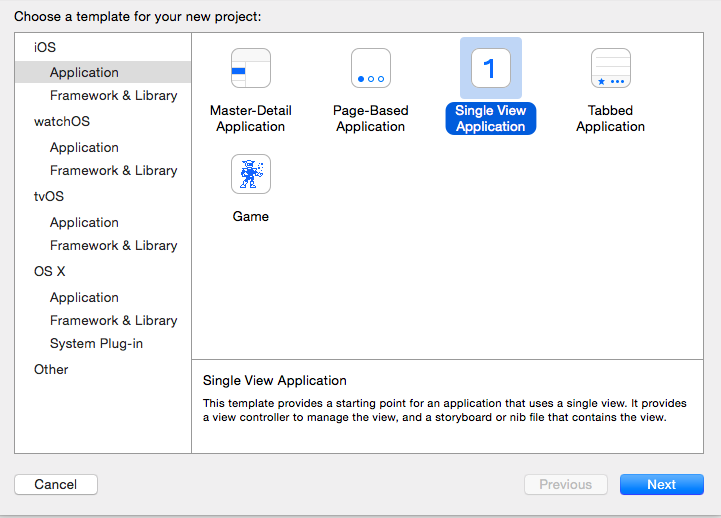
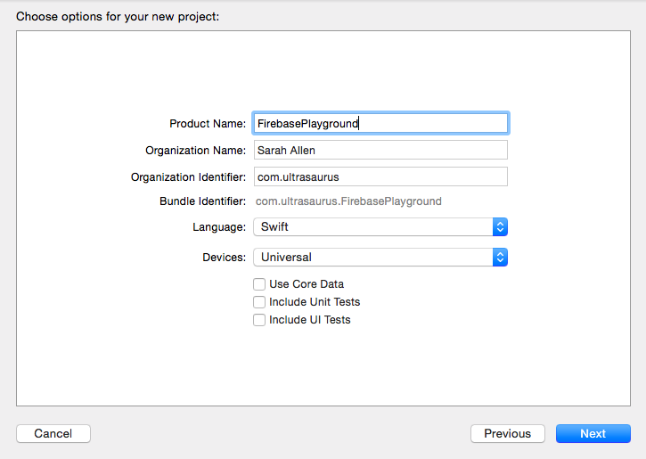
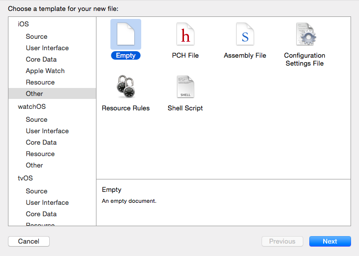

Xcode playgrounds are a delightful way to explore the Swift language -- once you get them set up.

To use this as a starting point, fork and clone the repo, cd into the directory, and:

```
rvm use ruby-2.2.4
gem install cocoapods
pod install
```

Then open the `FirebasePlayground.xcworkspace` and type code into `experiment.playground` file and it will automatically compile and execute, displaying results in the right-side panel.

## Original Setup Notes

It's a bit tricky to figure out how to use CocoaPods with Playgrounds, but the actual steps are straightforward:

Here are the steps to re-create this repo, using Swift 2, Xcode 7.2, OSX 10.10.5 (Yosemite):

note: cocoapods 0.39.0 has [issue with Ruby 2.3](https://github.com/CocoaPods/CocoaPods/issues/4345) — likely fixed in the 1.0 beta, but I stuck with older ruby and released CocoaPod for this exercise.

```
rvm use ruby-2.2.4
gem install cocoapods
```

Make a new Xcode project with File > New > Project...





then add a new Empty file to your project called Podfile by selecting from the menu File > New > File… then Other > Empty)




with the following contents:

```
platform :ios, '8.1'
xcodeproj 'FirebasePlayground'

use_frameworks!
target :FirebasePlayground, exclusive: true do
  pod 'Firebase'
end
```

back on the command-line:

```
pod install
```

This creates a new Xcode workspace, so we need to close the project in Xcode, then re-open Xcode with the file named something ending in `.xcworkspace`.

This new workspace should have both the original project and a new one called Pods.  Now we can create the Playground, by selecting the menu: File > New > Playground…  Then we save it in the root of our project directory, then add it to the project with the menu:  File > Add Files To “ParsePlayground”

Now this code should compile:

```
import Firebase
import XCPlayground
XCPlaygroundPage.currentPage.needsIndefiniteExecution = true
```

We want to set needsIndefiniteExecution so that async commands will work.
